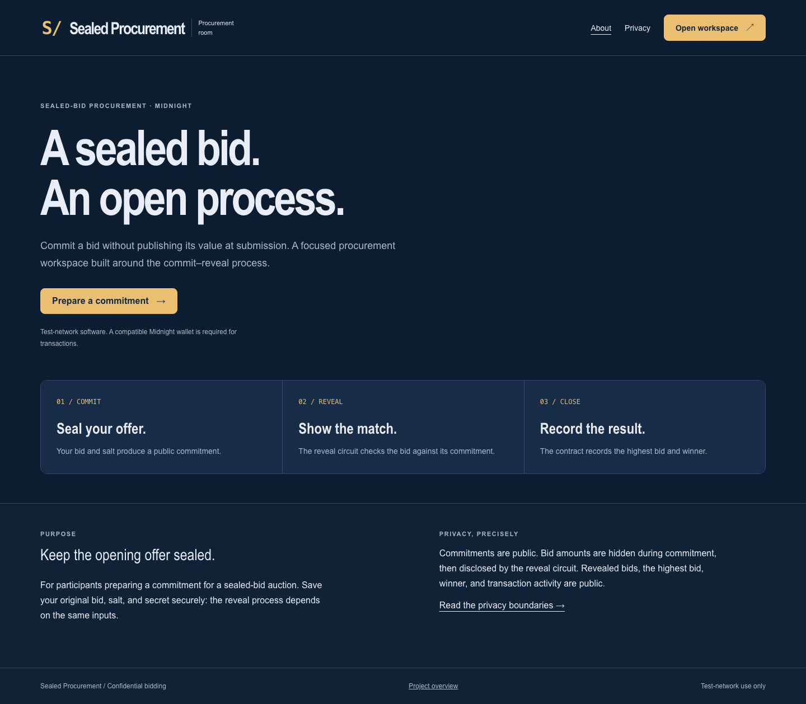
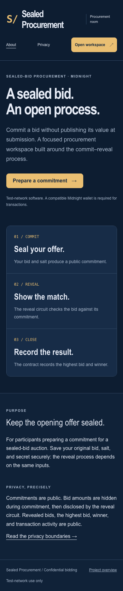
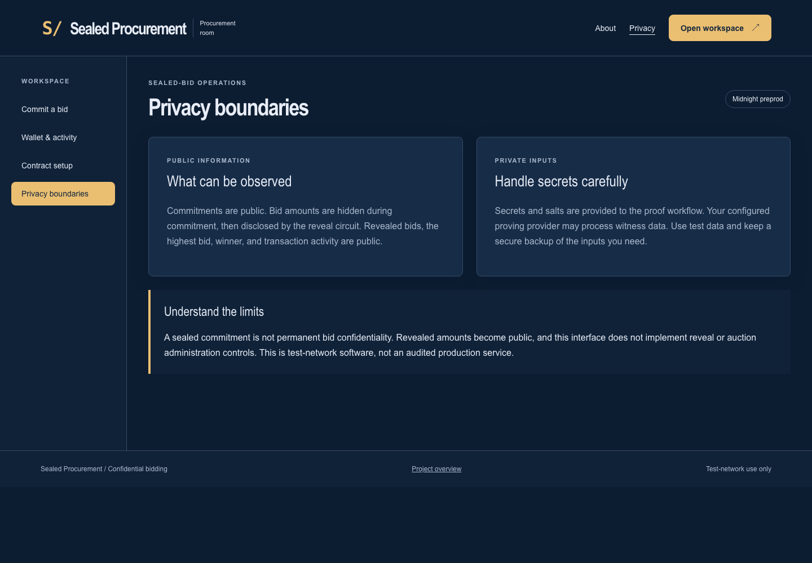
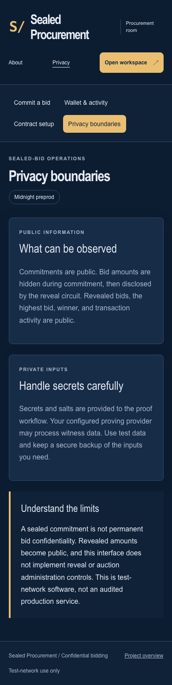
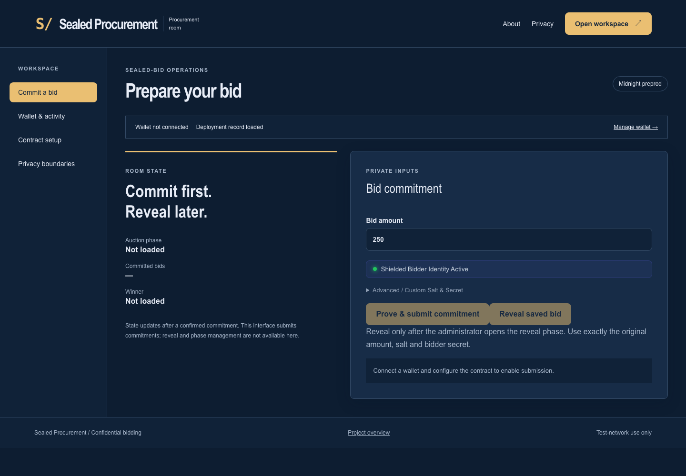
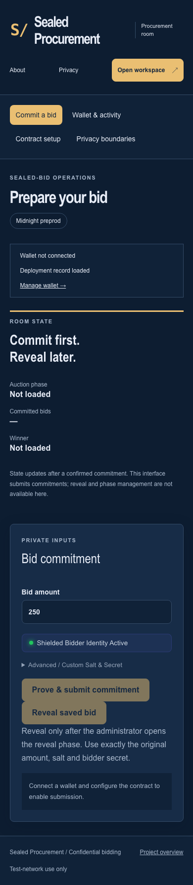
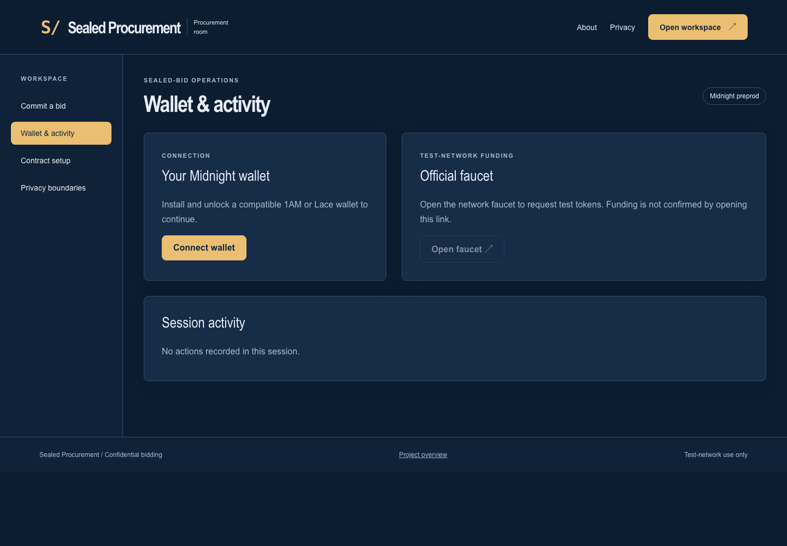
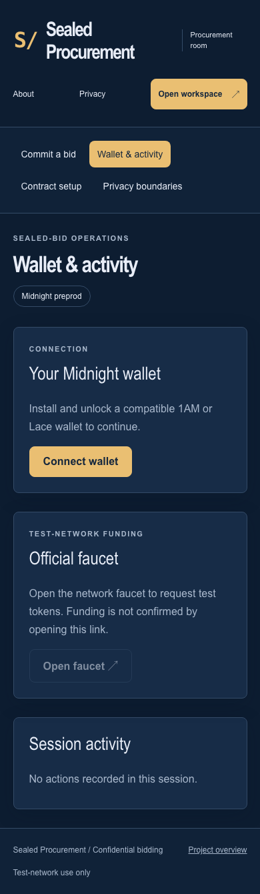
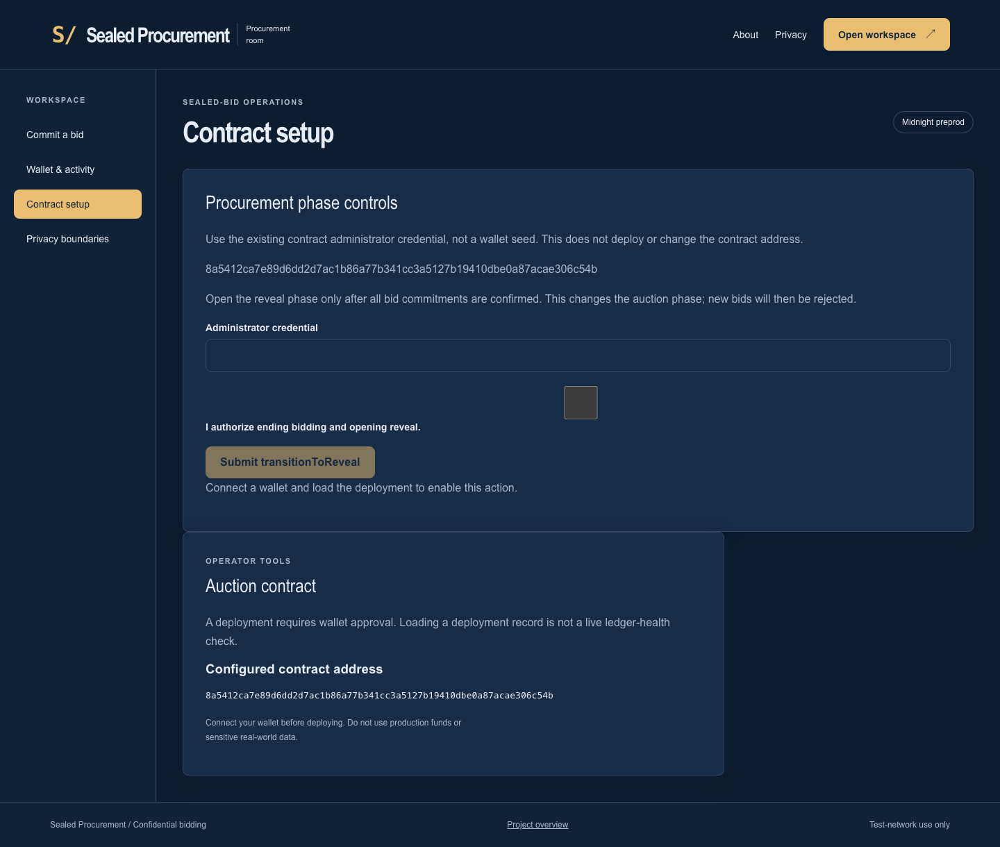
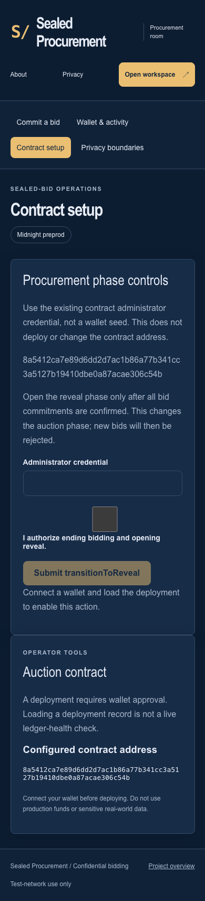

# Procurement Floor: Shielded Commercial Bidding Protocol 🏗️


## Desktop and mobile walkthrough

Fresh captures of this build at 1440 × 1000 and 390 × 844. Wallet disconnected; no credentials entered. These images document the interface, not transaction finality.

<details>
<summary>View every page at both screen sizes</summary>

| Page | Desktop | Mobile |
| --- | --- | --- |
| home |  |  |
| privacy |  |  |
| dashboard |  |  |
| walletHub |  |  |
| deployer |  |  |

</details>

Capture details: [manifest](screenshots/capture-manifest.json). Recorded walkthrough: [demo video](demo.webm).
### Rise In — Midnight Journey to Mastery (Level 4 Capstone Submission)

[](https://midnight.network)
[](https://docs.midnight.network)
[](https://risein.com)
[]()
[](https://github.com/jaynam04/sealed-bid-commercial-procurement/actions/workflows/frontend-ci.yml)
[](https://github.com/jaynam04/sealed-bid-commercial-procurement/actions/workflows/contract-ci.yml)

**Procurement Floor** is a confidential, zero-knowledge reverse auction protocol for enterprise procurement built on the **Midnight Network**. Vendors submit sealed commercial proposals and binding cryptographic bid commitments without disclosing their pricing structures to competitors, eliminating bid tampering, insider collusion, and unfair margin discovery.

---

## 🎬 Product Demo Video

- 🌐 **Watch Online:** [Stream on Google Drive ↗](https://drive.google.com/file/d/1jL1wpwGAf0QLbzpfDgt22L2805L5zs5a/view?usp=sharing)
- 📁 **Local Video File:** [`demo.webm`](./demo.webm)

<video src="./demo.webm" controls="controls" width="100%"></video>

---

## 📋 Rise In Level 4 Capstone Submission Evidence

| Requirement | Evidence / Implementation Details |
| :--- | :--- |
| **Public Source Repository** | [jaynam04/sealed-bid-commercial-procurement](https://github.com/jaynam04/sealed-bid-commercial-procurement) |
| **Commit Volume** | 25+ commits showing Compact contract architecture, UI, and test suites |
| **Compact Smart Contract** | `contracts/auction.compact` compiled with Compact 0.30.0 |
| **Automated Verification** | Full test suite in `src/test/auction.test.ts` testing bidding, commitments, and winner resolution |
| **Web DApp Frontend** | Enterprise bidding floor built with React, TypeScript, and Vite |
| **Instant Visitor Access** | Seamless Midnight Lace integration with zero-step credential derivation |
| **Preprod Deployment** | Verified on Midnight Preprod (`8a5412ca7e89...c54b`) |
| **Demo Walkthrough** | Video demonstrating RFP setup, sealed-bid commitment, and cryptographic winner reveal |
| **Documentation Dossier** | Complete [PROPOSAL.md](PROPOSAL.md), [TESTING.md](TESTING.md), [SECURITY.md](SECURITY.md), and [OPERATIONS.md](OPERATIONS.md) |

---

## 🌟 Executive Summary & Problem Solved

### The Problem
Traditional commercial procurement and public RFPs suffer from structural corruption and inefficiency:
1. **Bid Leakage:** Corrupt procurement officers leak competitors' bids before deadlines, enabling preferred vendors to undercut by marginal fractions.
2. **Margin Erosion:** Open blockchain auctions force vendors to reveal sensitive operational cost structures and margins to the entire market.
3. **Winner Retraction:** Uncommitted bidding allows bad actors to submit fraudulent bids without accountability.

### The Midnight Solution
Procurement Floor combines **Pedersen Commitments + Zero-Knowledge Proofs**:
- Vendors commit to their bids via one-way cryptographic hashes during the submission phase.
- Bid values are hidden from competitors, procurement officers, and on-chain observers.
- After the deadline, the contract validates the lowest compliant bid via zero-knowledge proof, awarding the contract trustlessly.

---

## 🔒 Zero-Knowledge Architecture & Privacy Model

```
       [Vendor Terminal]
               │
  (Bid Amount: $450,000, Blinding Salt)
               │
               ▼
     [Compact ZK Prover]
               │
  Generates Commitment = hash(Bid, Salt)
               │
               ▼
   [Midnight Preprod Blockchain]
               │
  1. Stores Commitment during Open Phase
  2. Rejects any late bids after Deadline
  3. Verifies Proof during Reveal Phase to select lowest valid tender
```

- **Private Witness:** Actual dollar bid amount, vendor cost breakdown, and private blinding salt.
- **Public Ledger State:** Tender commitment hashes, registered vendor identities, auction deadline, and finalized winning contract award.
- **Circuit Guarantee:** Losing vendors never have their private pricing structures revealed on-chain.

---

## 📜 Smart Contract Surface (`contracts/auction.compact`)

Key exported circuits:
- `submitBidCommitment(commitment)`: Vendors post binding zero-knowledge bid hashes.
- `revealLowestBid(bid_amount, salt)`: Verifies that revealed tender matches initial commitment and updates current lowest proposal.
- `finalizeProcurement()`: Closes bidding and awards the contract to the winning vendor.

---

## 🚀 On-Chain Deployment Coordinates

| Field | Preprod Verification Record |
| :--- | :--- |
| **Network** | Midnight Preprod |
| **Contract Name** | `auction` |
| **Contract Address** | `8a5412ca7e89d6dd2d7ac1b86a77b341cc3a5127b19410dbe0a87acae306c54b` |
| **Deployment Transaction** | `964d8611bfa1c02acbcea2798c7a0925dd86de8d5e1956d14bb029405838e363` |
| **Confirmation Status** | Confirmed by Midnight Preprod Indexer |

---

## 💻 Local Setup & Reproduction Guide

### Prerequisites
- Node.js 20.x or 22.x
- npm 10.x
- Compact compiler 0.30.0

```bash
# Install dependencies
npm install

# Compile zero-knowledge circuits
npm run compile

# Run automated tests
npm test

# Build production bundle
npm run build

# Launch development server
npm run dev
```

---

## 📁 Repository Structure

- `contracts/auction.compact`: Compact ZK contract governing commercial tenders and sealed-bid reveals.
- `src/App.tsx`: Procurement floor dashboard, RFP manager, and vendor submission desk.
- `src/midnightClient.ts`: Midnight Lace wallet connection and on-chain transaction lifecycle.
- `src/test/auction.test.ts`: Automated tests covering commitments, reveals, and winner determination.
- `PROPOSAL.md`, `TESTING.md`, `SECURITY.md`, `OPERATIONS.md`: Formal engineering runbooks.
